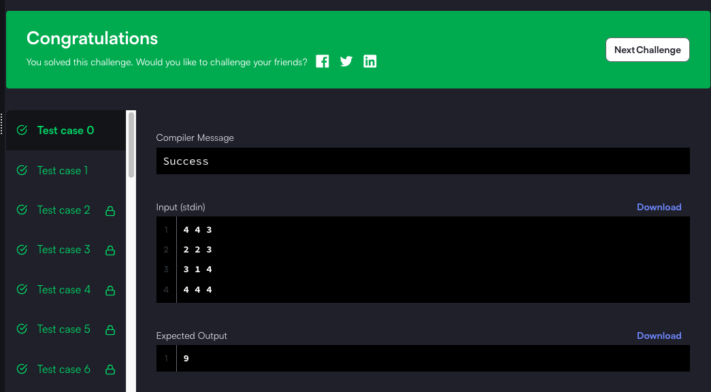

## 출처

- [해커 랭크 : Gridland Metro](https://www.hackerrank.com/challenges/gridland-metro/problem)

## 문제 설명

> 영문 사이트이므로 문제를 간단히 설명하겠습니다.

1. 가로등을 설치해야 하는데, 철도가 있는 지점에는 가로등을 설치할 수 없습니다.
2. 철도는 가로로만 설치되며, **철도끼리는 겹칠 수 있습니다.**
3. 문제에는 철도의 개수(k)와 철도의 시작점(r, c1)과 끝점(r, c2)이 주어지며, 이 때 가로등을 설치할 수 있는 지점의 개수를 구해야 합니다.

## 접근

### 시간복잡도 계산

- 철도의 개수 k <= 1000인 반면 전체 좌표의 크기 (n, m) < 10^9 입니다.
  > 따라서 각 좌표를 한번씩 방문하는 것은 불가능하며 주어진 철도의 범위로 문제를 해결해야 합니다.

### 각 Row에서 철도가 있는 지점 최적화

- 철도가 있는 지점을 빠르게 구하기 위해, 다음과 같은 [**라인 스위핑 알고리즘**](https://en.wikipedia.org/wiki/Sweep_line_algorithm)을 사용할 수 있습니다.
- 해당 알고리즘을 간단히 설명하자면, 특정한 선이 좌표나 평면을 이동하면서 특정 지점에서 한번씩 멈춰서 계산을 하고, 선이 모든 객체를 통과하면 계산이 종료되는 방식의 알고리즘입니다.
  > 원래라면 각 지점을 한번씩 방문해서 해당 지점에 철도가 있는지 확인해야 하지만, 정렬 후 라인 스위핑을 통해 철도가 겹치는 지점을 넓혀가는 방식으로 최적화할 수 있습니다.
- 다음은 (1x6) 크기의 지도에서 철도(k = 4)가 track = [[1, 1, 2], [1, 1, 3], [1, 2, 3], [1, 5, 6]] 으로 주어졌을 때 라인 스위핑을 통해 철도의 범위를 계산하는 과정입니다.
  

1. 주어진 철도를 col의 시작점(track[1]) 기준으로 정렬합니다.
   
2. 첫번째 철도를 탐색하면서 현재 철도의 시작점과 끝점인 left와 right를 설정합니다.
   
3. 다음 철도의 시작점이 현재 철도의 끝점(right)보다 작다면 끝점을 늘립니다.

   

   > 이 때, 끝점이 현재 철도의 끝점(right)보다 작다면([1,2,3]의 경우) 끝점을 늘릴 필요가 없습니다.

4. 다음 철도의 시작점이 현재 철도의 끝점보다 크다면, 현재까지 철도를 전체 크기에 추가하고 다시 시작점과 끝점을 설정합니다.
   

> 이제 위 알고리즘을 사용해서 전체 크기에서 철도가 있는 지점의 크기를 빼주면 됩니다.

### Overflow

문제에서 주어진 (n, m) <= 10^9 이라는 조건으로 전체 지도의 크기를 구하면 n \* m <= 10^18 이므로 정수 범위를 초과하게 됩니다.

> `-2^32 < int < 2^32` 이므로, 대략 `4 x -10^9 < int < 4 x 10^9` 범위를 초과하면 Overflow가 발생합니다.

따라서 전체 맵은 long 타입으로 선언해서 overflow를 방지해야 합니다.

## 풀이

```java

// [주의]반환값 long으로 변환 필요
public static long gridlandMetro(int n, int m, int k, List<List<Integer>> track) {

    // 철도 정렬 : row 순 -> 철도 시작점 순
    track.sort((o1, o2) -> {
        if (o1.get(0) == o2.get(0)) return Integer.compare(o1.get(1), o2.get(1));
        return Integer.compare(o1.get(0), o2.get(0));
    });

    // 전체 맵 크기 초기화(overflow 주의)
    long total = (long)n * m;
    int r = 0, left = 0, right = 0;

    // 전체 철도 탐색
    for (List<Integer> t : track) {

        // 현재 row보다 큰 값이면 새로운 row에서 탐색하기 위해 변수 초기화
        if (r < t.get(0)) {
            r = t.get(0);

            // 저장된 철도의 크기가 0보다 크면 전체 맵에서 제외
            if (right > 0) total -= (right - left + 1);
            left = 0; right = 0;
        }

        // 철도 시작점이 현재 오른쪽보다 크다면 현재까지의 철도 크기 전체 맵에서 제외
        if (t.get(1) > right) {
            if (right > 0) total -= (right - left + 1);

            // 현재 철도로 다시 세팅
            left = t.get(1);
            right = t.get(2);
        }

        // 철도 시작점이 현재 오른쪽보다 작을 때, right 갱신(right가 현재보다 작다면 갱신하지 않음)
        else if (t.get(2) > right) right = t.get(2);
    }

    // 남아있는 철도 전체 맵에서 제외
    if (right > 0) total -= (right - left + 1);

    return total;
}
```

## 결과



## 리뷰

주어진 조건을 토대로 정렬 후 탐색을 최적화하는 방법을 아는지 묻는 문제였습니다.

정렬된 상태에서 탐색하는 기법은 투포인터나 이분탐색만 알고 있었는데 **sweep line**을 통해 탐색하는 방법을 추가로 배울 수 있었습니다.

또한, 처음 주어진 반환값이 int여서 overflow를 의심하지 않았는데, 히든 케이스를 하나 까보니 overflow가 발생할 수 있음을 알게 되었습니다.

> HackerRank에서는 주어진 템플릿을 크게 신뢰하면 안되는 것 같습니다.

## References

| URL                                                                        | 게시일자    | 방문일자    | 작성자    |
| :------------------------------------------------------------------------- | :---------- | :---------- | :-------- |
| [Sweep line algorithm](https://en.wikipedia.org/wiki/Sweep_line_algorithm) | 2023.11.20. | 2024.11.13. | Wikipedia |
