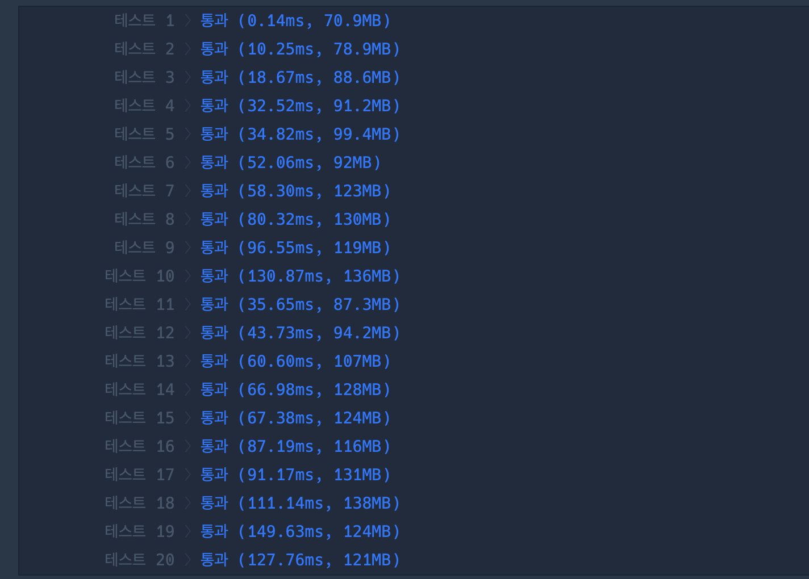

## 출처

- https://school.programmers.co.kr/learn/courses/30/lessons/131701

## 접근

- 원소의 길이가 1,000 이하이기 때문에 N^2 알고리즘을 사용해도 풀이가 가능합니다.
- 각 수열의 시작점에서 인덱스를 1칸씩 증가시키면서 합의 가지수를 찾는 문제입니다.
- 인덱스는 원형으로 연결되어 있기 때문에, 전체 수열의 길이보다 큰 인덱스는 다시 0부터 시작해야 합니다.
- 원형 배열을 구현하기 위해 다음과 같이 modular연산을 사용하면 쉽게 구현이 가능합니다.
  - 예시에서 주어진 수열 [7, 9, 1, 1, 4]에서 원형 배열을 더하는 방법을 알아보겠습니다.
  - 현재 값이 9(idx == 1)일때 이후의 값들은 다음과 같습니다.
    
  - now + 1 ~ 3 까지는 쉽게 구할 수 있지만, now + 4는 인덱스를 초과해버립니다.
  - 이 때, 다음과 같이 배열의 길이만큼 modular 연산을 하면 해당 인덱스를 다시 0부터 시작하도록 만들 수 있습니다.
    
  - 현재 값이 1(idx == 2)일때도 modular 연산을 통해 다음과 같이 원형 배열로 만들 수 있습니다.
    
- 이후에는 현재 값부터 원형으로 현재 값 이전까지 모든 값들을 더하면서 합의 가짓수를 찾아나가면 됩니다.
  > 저는 set를 활용해서 중복되는 값을 제거하였습니다.

## 풀이

```java
import java.util.*;

class Solution {
    public int solution(int[] elements) {

        // 합 저장
        Set<Integer> set = new HashSet<>();
        for (int i = 0; i < elements.length; i++) {
            set.add(elements[i]);
            int sum = elements[i];

            // 현재 인덱스 + 1 ~ 현재 인덱스 -1까지 확인
            for (int j = i + 1; j < i + elements.length; j++) {

                // modular 연산을 통해 원형 수열 구현
                int k = j % elements.length;
                sum += elements[k];
                set.add(sum);
            }
        }

        // 전체 합 개수 반환
        return set.size();
    }
}
```

## 결과



## 리뷰

- 배열의 인덱스를 원형처럼 사용하는 방법만 알면 쉽게 풀 수 있는 문제입니다.
  > 이러한 접근방법은 알고리즘 문제에서 자주 등장하기도 하고, 자료구조 중 배열로 Dequeue를 구현할 때에도 자주 사용되는 방법이니 알아두시면 좋을 것 같습니다.

## References

| URL | 게시일자 | 방문일자 | 작성자 |
| :-- | :------- | :------- | :----- |
