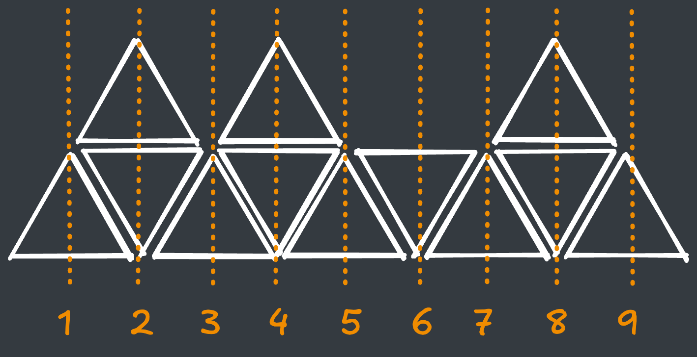
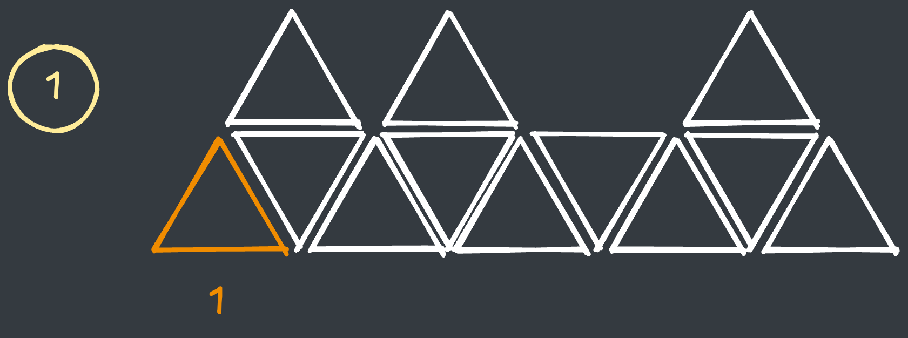
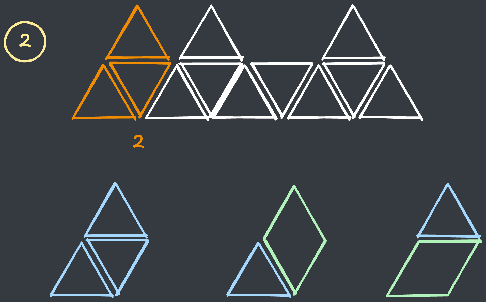
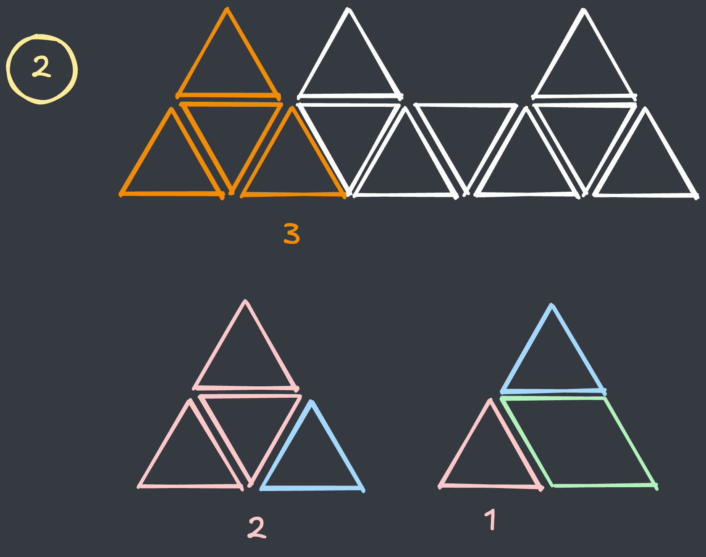
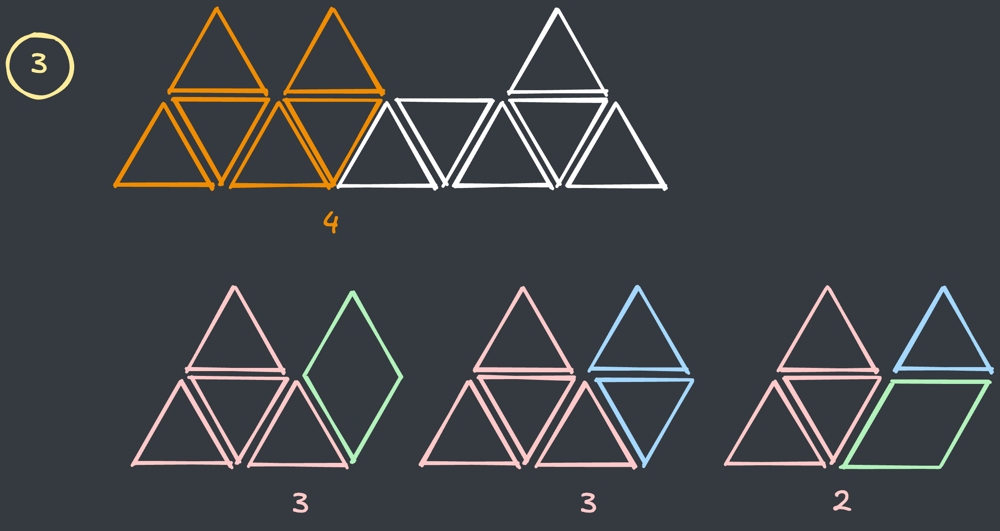
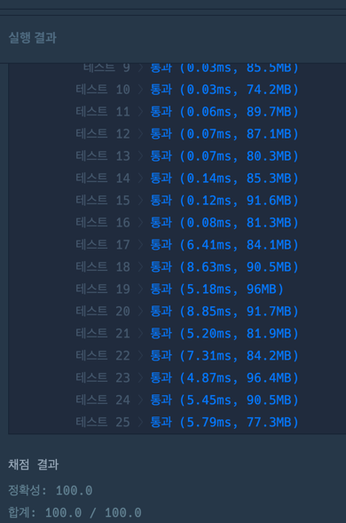

## 출처

- [2024 KAKAO WINTER INTERNSHIP 산 모양 타일링](https://school.programmers.co.kr/learn/courses/30/lessons/258705)

## 접근

### 시간복잡도 구하기

- `n <= 100,000` 이므로 전체 타일의 개수는 최대 사다리꼴의 윗변의 모든 자리에 삼각형을 넣을 수 있으므로 `2n + 1 + n <= 300,001`개 입니다.

- 이러한 삼각형의 배치를 완전탐색으로 구하는 것은 불가능하기 때문에, DP를 통한 최적화가 필요합니다. 

### 규칙성 찾기

예제의 타일을 1칸씩 세면서 경우의 수를 세면 규칙성을 확인할 수 있습니다.

다음과 같이 (1 ~ 9) 순으로 예제타일의 규칙성을 구해보겠습니다.



1. 첫번째 지점에서 타일을 만들 수 있는 경우의 수는 다음과 같이 **1가지**밖에 없습니다.
  

2. 두번째 지점에서 타일을 만드는 경우는 다음과 같이 **3가지**가 있습니다.
   
    > 아직 규칙성이 명확하지 않으니 좀더 진행하겠습니다.

3. 세번째 지점은 산 모양이 아닙니다. 이 때 타일을 만드는 경우는 다음과 같습니다.
  
   - 위와 같이 `산 모양이 아닐 경우`, **2번째 타일**과 **1번째 타일**로 현재 타일을 만들 수 있습니다.
   - 전체 경우는 

     `2번 타일 경우의 수 + 1번 타일 경우의 수 = 3 + 1 = 4` 입니다.

4. 네 번째 지점은 산 모양입니다. 이 때 타일을 만드는 경우는 다음과 같습니다.
   
   - 위와 같이 `해당 지점이 산 모양일 경우`, **이전 타일로 2가지**, **전전 타일로 1가지**를 합쳐 현재 타일을 만들 수 있습니다.
   - 전체 경우는

    `3번 타일 경우의 수 X 2 + 2번 타일 경우의 수 = 4 * 2 + 3 = 11` 입니다.

5. 이를 일반화하면 다음과 같습니다.
    ```java
    // 산 모양일 경우
    dp[i] = (dp[i - 1] * 2 + dp[i - 2]);
    
    // 산 모양이 아닐 경우
    dp[i] = (dp[i - 1] + dp[i - 2])
    ```

> 실제 풀이에서는 아랫변의 삼각형 개수가 `n`개가 아닌 `2n + 1`개 임에 주의합니다.

## 풀이

```java
class Solution {
    
    int MOD = 10007;
    
    public int solution(int n, int[] tops) {
        
        int t = 2 * n + 1;
        int[] dp = new int[t + 1];
        
        dp[0] = 1; dp[1] = 1;
        
        for (int i = 2; i <= t; i++) {
            if (i % 2 == 0 && tops[(i - 1) / 2] == 1) 
                dp[i] = (dp[i - 1] * 2 + dp[i - 2]) % MOD;
            
            else dp[i] = (dp[i - 1] + dp[i - 2]) % MOD;
        }
        
        return dp[t];
    }
}
```

## 결과

- 걸린 시간 : 2시간 초과



## 리뷰

타일 모양에 너무 집중하다 보니 규칙을 구하는데 오랜 시간이 걸렸습니다.

> DP문제는 가장 작은 단위부터 꼼꼼히 따져보는 습관을 가져야 할 것 같습니다.

## References

| URL | 게시일자 | 방문일자 | 작성자 |
| :-- | :------- | :------- | :----- |
