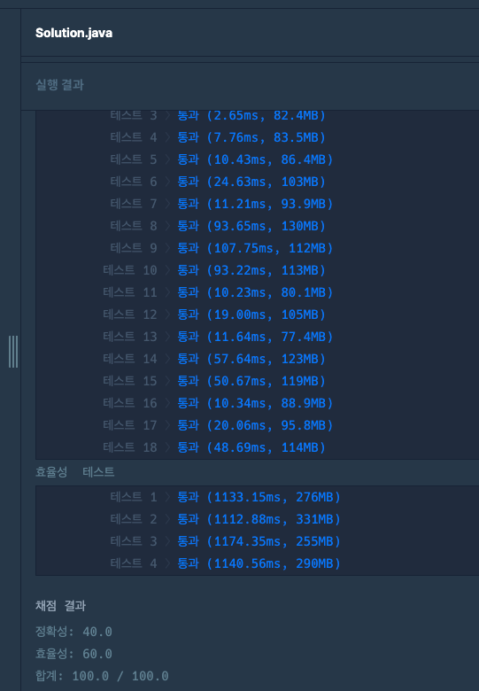

## 출처

- [2021 KAKAO BLIND RECRUITMENT 순위 검색](https://school.programmers.co.kr/learn/courses/30/lessons/72412)

## 접근

### 와일드카드 검색

와일드카드(`-`) 없이 검색을 구현하는 것은 각 지원자의 속성에 코딩테스트 점수를 저장하면, 속성별로 검색이 가능하기 때문에 큰 어려움이 없습니다.

- 와일드카드가 없는 상황은 다음과 같이 트리 구조로 데이터를 저장할 수 있습니다.


하지만, 문제에서 주어진 것처럼 쿼리 시 **와일드카드가 나오면 모든 정보를 포함하도록 탐색**을 해야 하기 때문에 이를 구현하기 위해 별도의 공간에 와일드카드 속성들을 저장해야 합니다.

- 와일드카드가 있는 상황에서 빠르게 검색을 하기 위해 와일드카드 트리를 별도로 생성해서 저장합니다.


- 위와 같이 와일드카드 노드를 별도로 생성하고 해당 노드의 단말에 코딩테스트 점수를 모두 저장하면, 해당 노드에 접근했을 때 `O(1)`의 시간복잡도로 모든 지원자 점수를 불러올 수 있습니다.

> 저는 시간복잡도를 최적화하기 위해 루트 ~ 리프노드까지의 속성을 key로 갖는 해시맵 자료구조로 구현했지만, 메모리가 부족한 상황이라면 트리 구조로 구현하는 것이 더 좋습니다.

### 이분 탐색

이렇게 저장된 지원자들의 코딩테스트 정보를 정렬한 뒤, 이분 탐색을 통해 빠르게 찾을 수 있습니다.

- 리프 노드에 저장되어 있는 코딩테스트 정보들을 정렬한 뒤, 이분 탐색을 하면
  
  시간복잡도를 `O(N) -> O(logN)`으로 최적화할 수 있습니다.

> 이 떄, 해당 점수 이상이 되는 모든 지원자들을 찾아야 하므로 `Lower Bound`를 찾은 뒤, 전체 지원자 숫자에서 빼주어야 합니다.

## 풀이

```java
import java.util.*;

class Solution {
    
    Map<String, List<Integer>> map;
    
    public int[] solution(String[] info, String[] query) {
        int[] answer = new int[query.length];
        
        map = new HashMap<>();
				
        // DFS로 맵 생성        
        for (String i : info) {
            String[] is = i.split(" ");
            int score = Integer.parseInt(is[is.length - 1]);
            dfs(new StringBuilder(), 0, is, score);
        }
        
        // 생성된 리스트 정렬
        for (List<Integer> l : map.values()) 
		        l.sort(Comparator.naturalOrder());
        
        // 쿼리 수행
        int idx = 0;
        for (String q : query) {
            String[] qs = q.split(" ");

            // 해시맵 키 생성
            StringBuilder key = new StringBuilder();
            for (int i = 0; i < qs.length; i+=2) key.append(qs[i]);
            int targetScore = Integer.parseInt(qs[qs.length - 1]);
            
            // NullPointer 방지
            List<Integer> list = map.get(key.toString());
            if (list == null) list = List.of(0);
            answer[idx++] = getCount(list, targetScore);
        }
        
        return answer;
    }
    
    void dfs(StringBuilder key, int cur, String[] infos, int score) {
        if (cur == infos.length - 1) {
            List<Integer> list = map.get(key.toString());
            if (list == null) {
                list = new ArrayList<>();
                map.put(key.toString(), list);
            }
            list.add(score);
            return;
        }
        
        // 기본 키
        StringBuilder temp = new StringBuilder(key.toString());
        temp.append(infos[cur]);
        dfs(temp, cur + 1, infos, score);
        
        // wildcard 키
        temp = new StringBuilder(key.toString());
        temp.append("-");
        dfs(temp, cur + 1, infos, score);
    }
    
    // BinarySearch로 정렬된 리스트에서 최소 위치 찾기
    int getCount(List<Integer> list, int target) {
        int left = 0, right = list.size(), middle = 0;
        
        while (left < right) {
            middle = (left + right) / 2;
            if (list.get(middle) >= target) right = middle;
            else left = middle + 1;
        }
        
        return list.size() - left;
    }
}
```

## 결과


## 리뷰

- 소요시간 : 2시간 초과

처음에 문제 아이디어를 떠올리는건 어렵지 않았으나, 트리를 구현하는 과정에서 너무 오랜 시간이 걸려셔 [공식 풀이](https://tech.kakao.com/posts/420)를 읽어보았습니다.
> 사실 공식풀이에도 풀이 아이디어를 간략히 소개했을 뿐, 코드나 구현이 적혀있는 것은 아니어서 저에게는 큰 힌트가 되지 못했습니다.

트리 뿐 아니라 이분탐색까지 활용해야 하는 점에서 자료구조의 특성을 이해하고 빠르게 탐색할 수 있는지를 묻는 문제인 것 같습니다.
> 확실히 카카오 문제는 핵심 아이디어를 빠르게 구현하는 능력이 무엇보다 중요한 것 같습니다.

## References

| URL                                          | 게시일자 | 방문일자 | 작성자 |
|:---------------------------------------------| :------- | :------- | :----- |
| [카카오 공식풀이](https://tech.kakao.com/posts/420) | 2021.01.25.|2024.12.03.|Kakao tech|